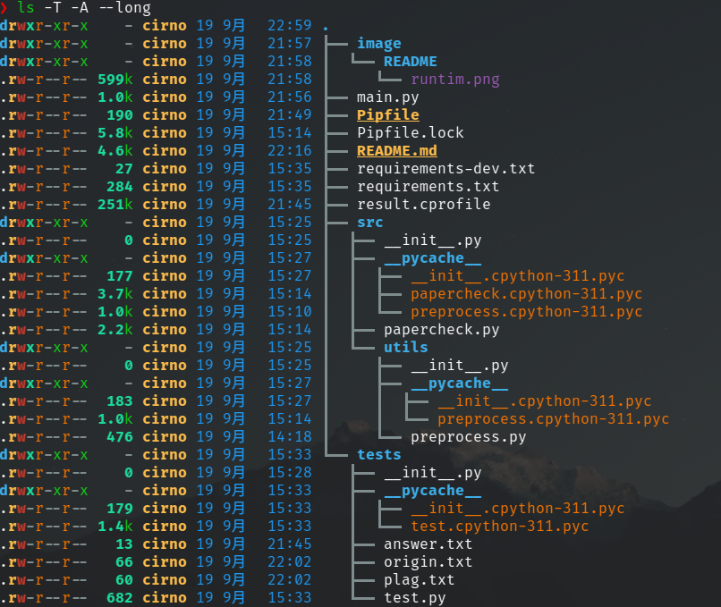
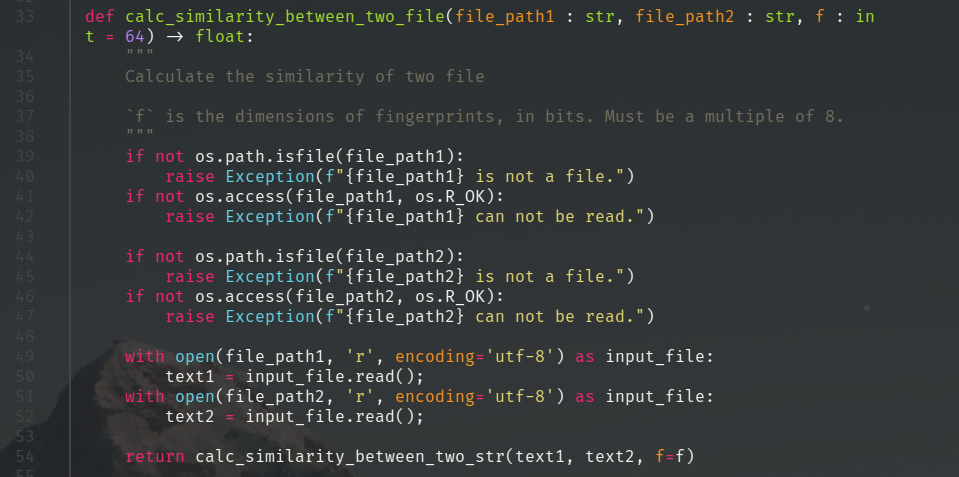
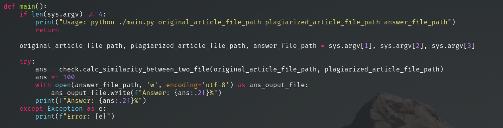
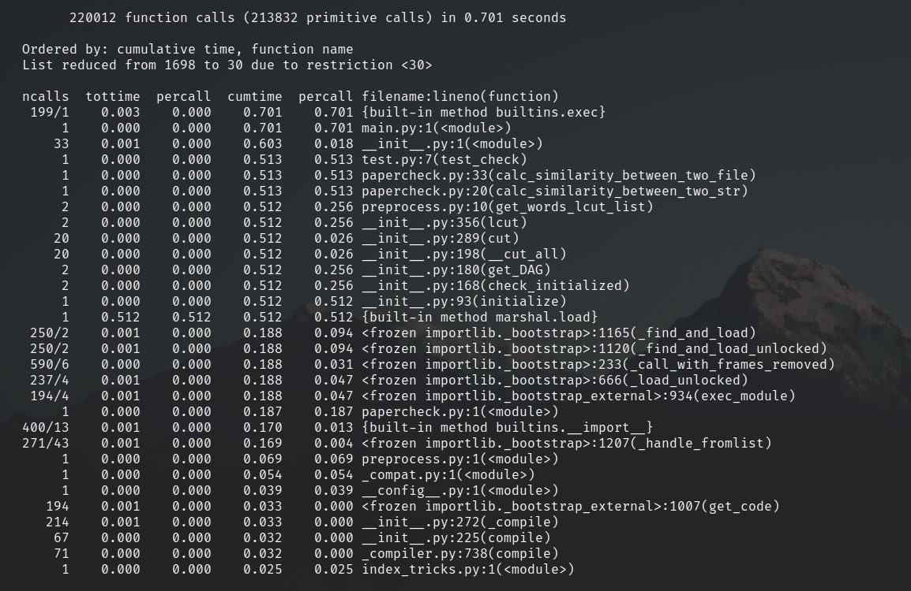

# PaperCheck

## 作业简述

| 这个作业属于哪个课程 |        [班级链接](https://edu.cnblogs.com/campus/jmu/ComputerScience21)        |
| :------------------: | :--------------------------------------------------------------------------: |
|  这个作业要求在哪里  | [作业要求](https://edu.cnblogs.com/campus/jmu/ComputerScience21/homework/13034) |
|      作业的目标      |                            设计一个论文查重算法。                            |

## 作业需求

设计一个论文查重算法，给出一个原文文件和一个在这份原文上经过了增删改的抄袭版论文的文件，在答案文件中输出其重复率。

- 原文示例：今天是星期天，天气晴，今天晚上我要去看电影。
- 抄袭版示例：今天是周天，天气晴朗，我晚上要去看电影。

要求输入输出采用文件输入输出，规范如下：

- 从命令行参数给出：论文原文的文件的绝对路径。
- 从命令行参数给出：抄袭版论文的文件的绝对路径。
- 从命令行参数给出：输出的答案文件的绝对路径。

## 项目结构

## 开发环境

- 系统环境：Arch Linux x86_64
  - 内核版本：6.5.3-zen1-1-zen
- 使用语言：Python3.11
- 第三方库：jieba, simhash

## 算法说明

使用 `simhash` 计算两个文本之间的重复率。

将文本预处理为不含除字符以外的其他字符的字符串，并使用 `simhash` 将文本转化为一个 $8$ 为倍数的字节大小的 `01` 特征字，并比较不同文本特征字之间的汉明距离，即可计算出文本重复率。

## 功能说明

- preprocess.py
  - 提供预处理字符串的方法。
- papercheck.py
  - 提供计算两个文本串之间的重复率方法。

## 单元测试

## 异常处理

对打开文件具有存在和读写权限处理。

对命令输入格式具有简单提示。对计算可能出现的意外错误有简单处理。

## 性能分析

性能分析工具，使用 `cProfile` 进行测试。

## PSP表格

|      ****PSP2.1****      | ****Personal Software Process Stages**** | ****预估耗时（分钟）**** | ****实际耗时（分钟）**** |
| :-----------------------------------: | :--------------------------------------------------: | :----------------------------------: | :----------------------------------: |
|               Planning               |                         计划                         |                  15                  |                  25                  |
|               Estimate               |               估计这个任务需要多少时间               |                  5                  |                  5                  |
|              Development              |                         开发                         |                  40                  |                  35                  |
|               Analysis               |              需求分析 (包括学习新技术)              |                  5                  |                  15                  |
|              Design Spec              |                     生成设计文档                     |                  5                  |                  5                  |
|             Design Review             |                       设计复审                       |                  15                  |                  5                  |
|            Coding Standard            |        代码规范 (为目前的开发制定合适的规范)        |                  4                  |                  6                  |
|                Design                |                       具体设计                       |                  12                  |                  6                  |
|                Coding                |                       具体编码                       |                  20                  |                  20                  |
|              Code Review              |                       代码复审                       |                  5                  |                  5                  |
|                 Test                 |         测试（自我测试，修改代码，提交修改）         |                  5                  |                  5                  |
|               Reporting               |                         报告                         |                  10                  |                  20                  |
|              Test Repor              |                       测试报告                       |                  2                  |                  3                  |
|           Size Measurement           |                      计算工作量                      |                  4                  |                  5                  |
| Postmortem & Process Improvement Plan |             事后总结, 并提出过程改进计划             |                  8                  |                  10                  |
|                                      |                         合计                         |                 155                 |                 170                 |
